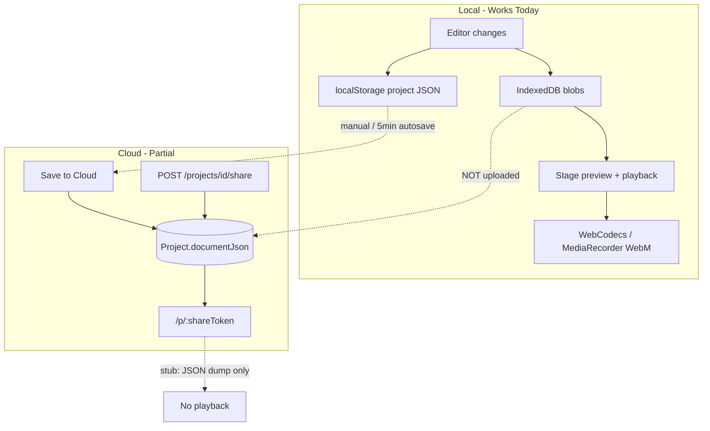
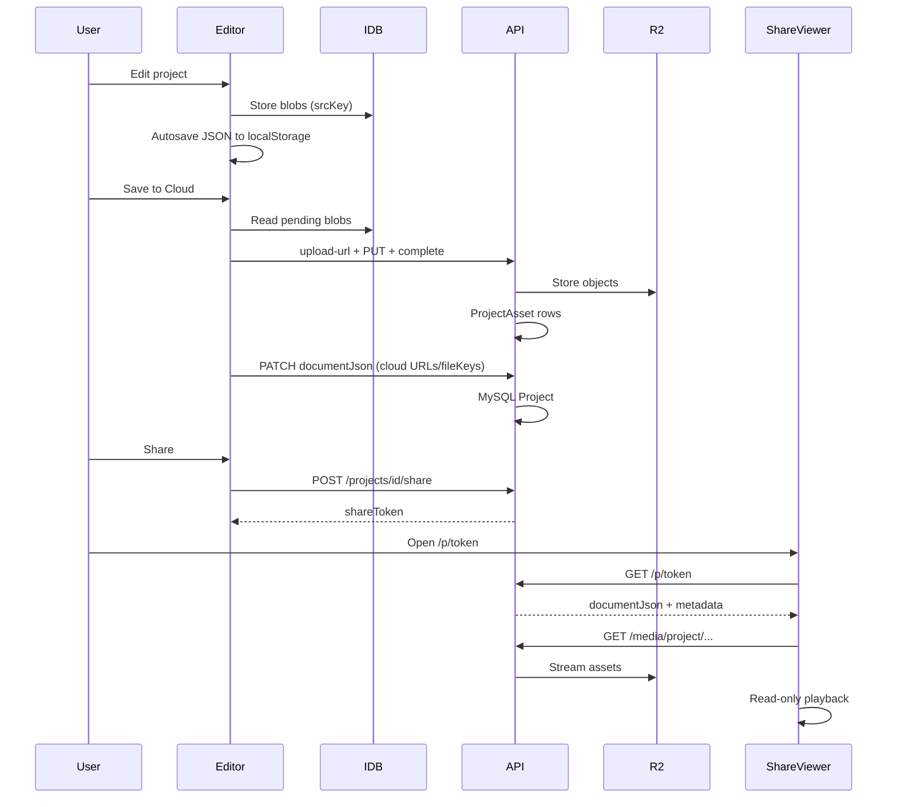

# Project Save, Publish & Share — Current State Audit & MVP Proposal

**Date:** 2026-06-26  
**Goal:** Document how we track projects today, audit save/publish/share, and propose the lowest-cost MVP that defers server-side rendering (ffmpeg worker) as long as possible.

---

## Executive Summary

Today the app is **local-first, single-project-per-browser**. One project JSON lives in `localStorage`; user media blobs live in **IndexedDB**. Cloud sync is additive: signed-in users can push the JSON document to MySQL, but **media never leaves the browser** in Phase 1. Sharing APIs exist on the server; the share page is a stub.

**We already render projects without an ffmpeg worker.** The editor preview and client-side WebCodecs export cover creator workflows. An ffmpeg worker is only needed for **server-hosted MP4 output** (social upload, email attachments, offline playback on dumb players)—not for editing, preview, or share-link playback.

**Recommended MVP:** Wire project media upload to R2 (clone the working community-asset pattern), hydrate `documentJson` with cloud URLs on save/share, and ship a read-only **ShareViewer** that reuses the existing runtime. Keep export as browser-only WebM download. Defer `apps/render-worker`, `RenderJob`, and ffmpeg until there is explicit demand for cloud MP4.

---

## 1. Current Project Tracking Model

### 1.1 Local (primary)

| Store | Key / DB | Contents |
|-------|----------|----------|
| `localStorage` | `audio-visual-layer.project.v1` | Full `Project` JSON (`schemaVersion: 1`) |
| `localStorage` | `audio-visual-layer.meta.v1` | `{ savedAt, name }` for UI badge |
| `localStorage` | `avl.cloud-project-id` | **Single** cloud project ID for this browser session |
| `localStorage` | `avl-export-preset-id` | Export quality preference |
| `localStorage` | `avl-export-webm-meta` | Last local export filename/mime |
| IndexedDB | DB `avl-files-v1`, store `blobs` | Binary blobs keyed by `fileKey` (`img_*`, `vid_*`, `aud_*`) |

**Load path:** Editor bootstraps from `loadSavedProject()` → default project if missing (`useEditorHistory`).

**Autosave:** Debounced 400ms write on every project change (`useEditorPersistence`). Blob URLs are **stripped** before JSON serialization; blobs are referenced by `settings.srcKey` (layers) and `audio.fileKey` (track). On reload, `useMediaLibrary` rehydrates blob URLs from IDB.

**Implication:** One active project per browser profile. Opening a second project would overwrite local state unless we add a project picker or namespaced keys.

### 1.2 Cloud (additive, one linked project)

| Model | Purpose |
|-------|---------|
| `Project` | `documentJson` = full client `Project` type; `title`, `schemaVersion`, `visibility`, optional `thumbnailUrl` |
| `ProjectAsset` | R2 `fileKey` registry per project — **schema exists, not wired** |
| `ProjectShare` | At most one share row per project; `shareToken` → public URL |

**Sync path:** Manual "Save to Cloud" + optional auto-save every 5 minutes when dirty and signed in. First save **creates** a row and stores its id in `avl.cloud-project-id`; subsequent saves **PATCH** the same row. Logout or user change clears `avl.cloud-project-id`.

**What gets saved:** `JSON.parse(JSON.stringify(project))` — structure and settings, **not** IDB blobs. Cloud `documentJson` after save has empty `audio.url` and empty layer `src` where those were blob URLs locally (same strip logic as local save).

**API surface (implemented):** `GET/POST /projects`, `GET/PATCH/DELETE /projects/{id}`, `POST/DELETE /projects/{id}/share`, public `GET /p/{shareToken}`.

**UI gaps:** No project list, no load-from-cloud, no share/publish button. `useProjects()` exists in SDK but is unused in the web app.

### 1.3 Document shape (`Project`)

Defined in `apps/web/src/features/visualizer/project/types.ts`:

- `name`, `schemaVersion: 1`, `stage`, `layers[]`, optional `audio`, optional `microEvents`
- Media references: `audio.fileKey`, layer `settings.srcKey` (local IDB keys today)
- No separate normalized SQL for layers/effects — intentional

---

## 2. Save / Publish / Share — Flow Audit

### 2.1 Save (local)

| Step | Status |
|------|--------|
| Autosave project structure | ✅ |
| Persist uploads in IDB | ✅ |
| Restore media after refresh | ✅ |
| Survive clear-site-data | ❌ |
| Multi-project library | ❌ |

### 2.2 Save (cloud)

| Step | Status |
|------|--------|
| Create/update `Project` row | ✅ |
| Link one cloud id per browser | ✅ |
| Upload media to R2 | ❌ stub 501 |
| Create `ProjectAsset` rows | ❌ |
| Load cloud project into editor | ❌ |
| List user's projects in UI | ❌ |

### 2.3 Publish / Share

In this codebase **publish = share**: `POST /projects/{id}/share` sets `visibility: PUBLIC` and upserts `ProjectShare.shareToken`. `DELETE` revokes token and sets `PRIVATE`.

| Step | Status |
|------|--------|
| Server share/unshare | ✅ |
| Public fetch by token | ✅ |
| Editor "Share" / copy link UI | ❌ |
| ShareViewer playback | ❌ placeholder |
| Shared viewer receives media | ❌ (blobs never uploaded) |
| OG thumbnail / embed video | ❌ |

### 2.4 Export (render)

| Capability | Where | Status |
|------------|-------|--------|
| Live preview | Browser Stage + AudioEngine | ✅ |
| PNG frame | Canvas | ✅ |
| WebM video | WebCodecs (VP8/VP9 + Opus) or MediaRecorder fallback | ✅ |
| MP4 | — | ❌ (WebM only today) |
| Cloud render / queue | ffmpeg worker | ❌ not built |

Cross-origin isolation headers (`COOP`/`COEP`) are already set in Vite for WebCodecs threading; ffmpeg.wasm is mentioned as a future option, not implemented.

---

## 3. Can We Render Without an ffmpeg Worker?

**Yes — for all creator-facing and share-link MVP scenarios.**

| User need | Without ffmpeg worker | With ffmpeg worker |
|-----------|----------------------|-------------------|
| Edit & preview | ✅ Existing runtime | Unnecessary |
| Download finished video | ✅ Client WebM export | Optional MP4 + heavier presets |
| Share link others can watch | ✅ Browser playback in ShareViewer | Only needed if you require a static MP4 file |
| Instagram/TikTok upload | ⚠️ User converts WebM→MP4 locally, or we add later | ✅ Server MP4 |
| Email attachment / offline TV | ❌ | ✅ |
| Pixel-perfect subtitle burn-in vs preview | ⚠️ Same canvas path for preview + export | Different pipeline (ASS/SRT via ffmpeg) |

The expensive part is **server CPU + ops**: a dedicated Railway service, job queue, temp disk, ffprobe/ffmpeg lifecycle, R2 egress for outputs, stale-job recovery, quotas, and frontend polling. That is justified when **cloud MP4** is a product requirement—not for MVP share.

**Client export limitations to accept for now:**

- Output is WebM, not MP4 (Safari download/share friction).
- Export ties up the user's machine and tab.
- Long projects / 60fps can be slow or OOM on weak devices.
- Subtitle appearance in export matches canvas, not a broadcast ASS pipeline.

These are acceptable tradeoffs to **postpone ffmpeg cost**.

---

## 4. Cost Comparison (Rough)

| Item | No worker MVP | + ffmpeg worker |
|------|---------------|-----------------|
| New infra | R2 bucket (likely already planned) | + Railway render-worker service |
| Dev time | ~1–2 weeks (upload + ShareViewer) | +3–6 weeks (see `docs/ffmpeg_worker_dev_prompts.csv`) |
| Running cost | R2 storage + egress on shared assets | + CPU minutes per render, worker always-on or cold-start |
| Complexity | Reuse community upload pattern | RenderJob schema, claims, retries, cancel, signed download URLs |
| Risk | Shared projects missing media until upload wired | Worker abuse, stuck jobs, font/subtitle parity |

---

## 5. MVP Proposal — Least Cost

**Principle:** Share **projects** (interactive documents + cloud media), not **pre-rendered videos**. Export stays **local WebM**. No `RenderJob`, no ffmpeg, no third Railway service.

### 5.1 MVP scope (in)

1. **Project asset upload (R2)**  
   - Implement `/assets/upload-url` + `/assets/complete` (stubs today).  
   - Mirror `CommunityAsset` flow: presigned PUT → verify → `ProjectAsset` row.  
   - Key convention: `projects/{userId}/{projectId}/{uuid}-{filename}`.

2. **Save-to-cloud uploads media**  
   - Before PATCH/POST `documentJson`, scan for local-only keys (`img_*`, `vid_*`, `aud_*` not yet in R2).  
   - Upload blobs from IDB; rewrite `fileKey` / `srcKey` to cloud keys; set `url` to API-proxied media URL (same COEP-safe pattern as community media).  
   - Idempotent: skip keys already registered in `ProjectAsset`.

3. **ShareViewer playback**  
   - Replace JSON dump with read-only editor shell: load `documentJson`, resolve media URLs from `fileKey`, run existing Stage + audio (no inspector edits).  
   - Optional: capture share URL + "Copy link" in editor after `POST /projects/{id}/share`.

4. **Publish gate**  
   - Block share (or warn) if required media failed upload.  
   - Require cloud save before share so `projectId` and assets exist server-side.

5. **Minimal project recovery**  
   - Profile or simple modal: list `GET /projects`, open one → fetch full doc → replace local project + set `avl.cloud-project-id`.  
   - Still one active project in editor; list is for recovery/navigation, not true multi-edit.

### 5.2 MVP scope (out / deferred)

- ffmpeg worker, `RenderJob`, cloud MP4
- Multi-project parallel editing or branching
- Autosave replacing local (keep local primary)
- Share page OG video/thumbnail generation (optional static PNG later)
- Email notifications for share
- Guest/anonymous cloud save
- WebM→MP4 client-side conversion (ffmpeg.wasm) — only if WebM blocker shows up in user testing

### 5.3 Suggested implementation order

| Phase | Work | Est. |
|-------|------|------|
| **A** | Wire project asset upload handlers + SDK hooks | 2–3 days |
| **B** | Media sync on `handleSaveToCloud` | 2–3 days |
| **C** | ShareViewer read-only playback | 2–4 days |
| **D** | Share button + copy link + publish validation | 1 day |
| **E** | Basic project list / open from cloud | 2 days |

**Total:** ~2 weeks focused work, mostly reusing existing patterns.

### 5.4 Data flow (target MVP)

---

## 6. When to Add the ffmpeg Worker

Add server render when **at least one** is true:

- Product requires **MP4/H.264** deliverable without user-side conversion
- Share must be a **single video file** (embed in Slack, email, CMS) not an interactive page
- Client export fails often on target devices (mobile Safari, low RAM)
- Paid tier or batch export needs reliable server-side quality presets

Until then, treat `docs/ffmpeg_worker_dev_prompts.csv` as a **Phase 3 backlog**, not MVP. The csv already scopes v1 correctly (DB queue, no Redis, concurrency 1)—but it depends on **ProjectAsset + R2** being done first anyway.

---

## 7. Risks & Mitigations

| Risk | Mitigation |
|------|------------|
| Shared link opens but media 404 | Gate share on successful asset sync; show clear errors on save |
| Large uploads slow save | Progress UI; upload only changed/new blobs |
| IDB cleared, cloud doc references missing keys | On open from cloud, fetch from R2 only; local IDB is cache |
| COEP blocks third-party media | Continue API-proxied `/media/project/*` routes (same as community) |
| One-project model confuses users | Short-term: project list; long-term: namespaced local keys per project id |
| WebM not accepted by social platforms | Document "download then convert"; add worker or wasm later |

---

## 8. Success Criteria (MVP done)

- [ ] Signed-in user saves project; audio/images/video available after reload on another device/browser session
- [ ] User publishes share link; recipient sees **playback**, not raw JSON
- [ ] Unpublish revokes access (existing API)
- [ ] Local editing unchanged for anonymous users
- [ ] Export still produces WebM locally with no server render cost
- [ ] No ffmpeg worker deployed

---

## 9. Key Files (reference)

| Area | Path |
|------|------|
| Local persistence | `apps/web/src/features/visualizer/project/projectPersistence.ts` |
| IDB blobs | `apps/web/src/features/visualizer/storage/idbStorage.ts` |
| Cloud save | `apps/web/src/features/visualizer/editor/VisualizerEditor.tsx` |
| Prisma schema | `packages/db/prisma/schema.prisma` |
| Share API | `apps/server/src/services/ProjectService.ts` |
| Share page stub | `apps/web/src/pages/ShareViewer.tsx` |
| Asset upload stubs | `apps/server/src/handlers/assets.ts` |
| Community upload (template) | `apps/server/src/handlers/admin.ts`, `MediaStorageService.ts` |
| Client export | `apps/web/src/features/visualizer/export/webcodecs.ts` |
| ffmpeg worker backlog | `docs/ffmpeg_worker_dev_prompts.csv` |

---

## 10. Decision

**Ship MVP without ffmpeg worker.** Invest in R2 project media + ShareViewer playback + thin share UX. Keep rendering in the browser for creators; defer cloud MP4 until usage or platform requirements force it.
